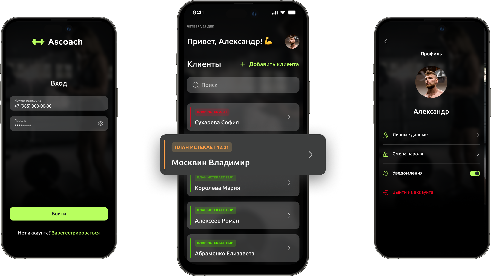
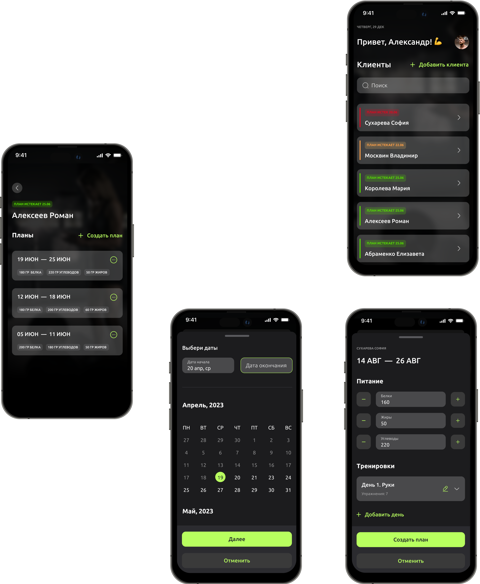

<h2>Figma</h2>
https://www.figma.com/file/l8H9Q4ZCd00mEOV9YPLDlP/Ascoach?type=design&node-id=30-16481&mode=design

<h2>Environments</h2>
DEV: http://54.167.94.215/docs  <i>development server  
RC: http://54.208.37.132/docs   <i>Apple release candidate server

<h2>Local Testing</h2>

```bash
export TEST_ENV=active
cd backend
pytest tests
```

<h2>Deployment</h2>

```bash
docker-compose up --build
```
